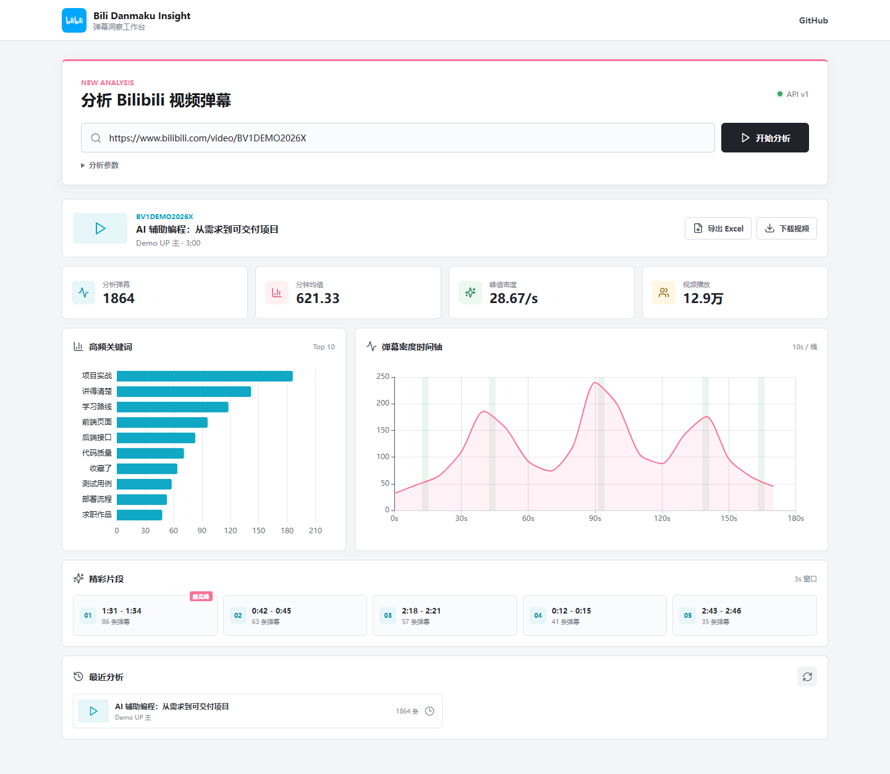
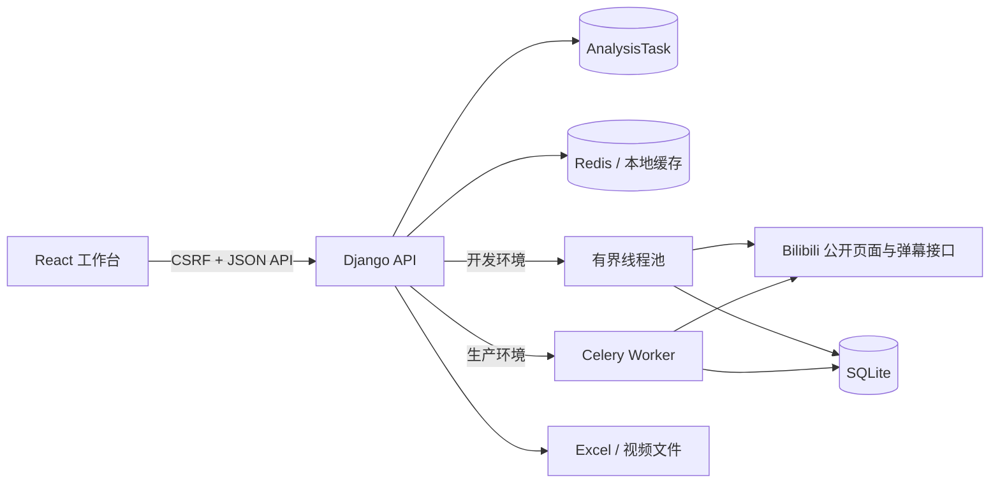

# Bili Danmaku Insight

一个面向 Bilibili 公开视频的弹幕分析工作台。输入视频链接或 BV 号后，系统会异步抓取弹幕，输出高频关键词、密度时间轴、多个精彩片段和核心互动指标，并保存分析历史、导出多工作表 Excel。

这不是一张功能展示页，而是一套可以实际运行、测试和部署的 React + Django 项目，重点体现 Web API 设计、异步任务、数据处理、可视化与工程化交付能力，可作为 Python Web、数据采集与可视化方向的完整作品。



## 页面能力

- 支持 Bilibili 视频链接、短链与 BV 号，严格限制外部请求目标
- 基于 jieba 和停用词表统计可配置的 Top N 高频词
- 按时间桶生成完整弹幕密度序列，并标记多个非重叠高峰
- 使用精确时间戳滑动窗口定位高互动片段，不损失亚秒精度
- 保存视频、分析摘要、任务状态和导出记录
- 长耗时分析与视频下载通过后台任务执行
- 一键导出概览、关键词、时间轴和精彩片段四张 Excel 工作表
- Windows 脚本与 Docker Compose 两种运行方式

## 技术栈

| 层级 | 主要技术 |
| --- | --- |
| 前端 | React 19、Vite 6、Axios、ECharts、Lucide |
| API | Python 3.11+、Django 5.2、django-cors-headers |
| 任务与缓存 | 本地线程池；生产环境 Celery + Redis |
| 数据处理 | Requests、BeautifulSoup、jieba、openpyxl、yt-dlp |
| 工程化 | Docker Compose、Nginx、Gunicorn、GitHub Actions、Ruff |

## 架构



后端按职责拆分为 URL 校验、Bilibili 客户端、弹幕算法、导出、下载和任务编排。接口只处理输入输出，不承担抓取和计算逻辑。

## 本地运行

环境要求：Python 3.11+、Node.js 20.17+、npm。视频音画合并还需要系统可用的 FFmpeg。

```powershell
powershell -ExecutionPolicy Bypass -File .\scripts\setup.ps1
.\start_project.bat
```

浏览器访问 `http://127.0.0.1:5173`。停止服务：

```powershell
.\stop_project.bat
```

也可以分别启动：

```powershell
# 后端
.\backend\.venv\Scripts\python.exe .\backend\manage.py runserver 127.0.0.1:8000

# 前端，另开终端
Set-Location .\frontend
npm run dev
```

本地默认使用最多两个工作线程执行任务，不依赖 Redis。

## Docker 运行

```powershell
Copy-Item .env.example .env
docker compose up --build
```

访问 `http://localhost:5173`。Compose 会启动 Nginx、Django/Gunicorn、Celery Worker 与 Redis；数据库、下载文件通过具名卷保存。

## API v1

所有写接口都启用 Django CSRF 防护。浏览器客户端先请求 `GET /api/v1/csrf/` 初始化 Cookie。

| 方法 | 路径 | 用途 |
| --- | --- | --- |
| `GET` | `/api/v1/health/` | 健康检查 |
| `POST` | `/api/v1/analyses/` | 创建分析任务 |
| `GET` | `/api/v1/tasks/{uuid}/` | 查询任务状态与结果 |
| `GET` | `/api/v1/analyses/history/` | 查询最近分析 |
| `GET` | `/api/v1/analyses/{video_id}/` | 查询单次分析 |
| `POST` | `/api/v1/exports/` | 导出分析 Excel |
| `POST` | `/api/v1/downloads/` | 创建视频下载任务 |

创建分析任务：

```json
{
  "url": "BV1xx411c7mD",
  "top_n": 20,
  "bucket_seconds": 10,
  "window_seconds": 3,
  "peak_count": 5
}
```

接口返回 HTTP 202 和任务 ID；任务状态依次为 `pending`、`running`、`success` 或 `failed`。

## 配置

| 变量 | 默认值 | 说明 |
| --- | --- | --- |
| `DJANGO_DEBUG` | `true` | 生产环境必须设为 `false` |
| `DJANGO_SECRET_KEY` | 本地占位值 | 生产环境必须提供真实随机密钥 |
| `DJANGO_ALLOWED_HOSTS` | `localhost,127.0.0.1` | 后端允许的 Host |
| `CORS_ALLOWED_ORIGINS` | 本地前端地址 | 允许访问 API 的前端来源 |
| `COOKIE_SECURE` | 跟随调试模式 | HTTPS 部署设为 `true` |
| `DJANGO_SECURE_SSL_REDIRECT` | `false` | 由应用强制跳转 HTTPS 时启用 |
| `TASK_EXECUTION_MODE` | `thread` | `thread`、`inline` 或 `celery` |
| `REDIS_URL` | 空 | Redis 缓存和 Celery 连接地址 |
| `BILIBILI_CACHE_TTL` | `600` | 抓取结果缓存秒数 |
| `MAX_BILIBILI_PAGE_MB` | `5` | 视频页面响应体积上限 |
| `MAX_DANMAKU_RESPONSE_MB` | `25` | 弹幕 XML 响应体积上限 |
| `ANALYSIS_RATE_LIMIT` | `10` | 单 IP 每分钟分析请求数 |
| `DOWNLOAD_RATE_LIMIT` | `3` | 单 IP 每分钟下载请求数 |
| `MAX_VIDEO_DOWNLOAD_MB` | `500` | 下载体积上限 |
| `VITE_API_BASE_URL` | `http://127.0.0.1:8000` | 前端 API 地址 |

需要登录态下载时，把 Netscape 格式 Cookie 保存为 `backend/cookie/cookie.txt`。该文件已被忽略，绝不能提交到 Git。

## 测试与质量检查

```powershell
.\backend\.venv\Scripts\ruff.exe check backend
.\backend\.venv\Scripts\python.exe .\backend\manage.py check
.\backend\.venv\Scripts\python.exe .\backend\manage.py test myapp

Set-Location .\frontend
npm run build
```

测试不访问真实 Bilibili 网络，使用固定 HTML/XML 样本验证解析、精确时间窗口、URL 防护、CSRF、限流、历史记录和 Excel 导出。

## 设计记录

完整的优化动机、方案选择、取舍和项目表达见 [docs/OPTIMIZATION_RATIONALE.md](docs/OPTIMIZATION_RATIONALE.md)。

## 合规说明

本项目用于学习、作品展示和对公开可访问数据的低频本地分析。使用者应遵守 Bilibili 服务条款、robots 约定、版权规则及所在地法律法规；请勿用于批量抓取、绕过访问控制或传播未获授权的内容。

前端最初基于 `react-landing-page-template` 改造，其 MIT 许可证保留在 `frontend/LICENSE`。
